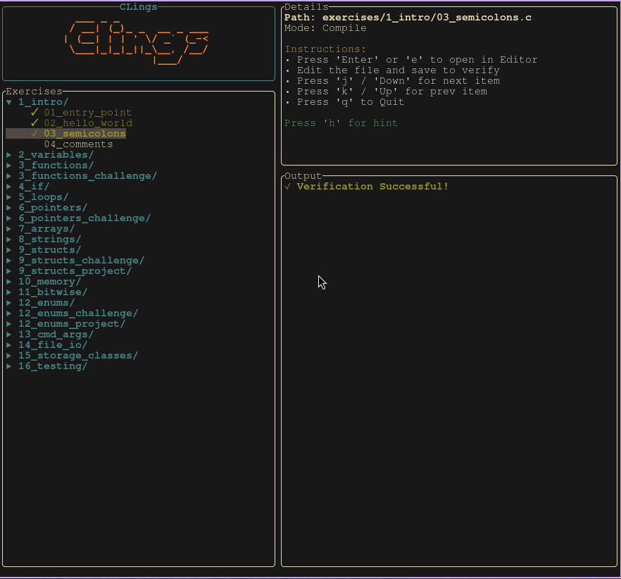

# CLings

CLings is a small interactive tool to help you get used to reading and writing C code. It mimics the popular "Rustlings" and "Ziglings" projects. The goal is to learn C by fixing small broken programs.

## 📋 Prerequisites

- **Rust**: You need to have the Rust toolchain installed to run the `clings` tool. [Install Rust](https://www.rust-lang.org/tools/install).
- **GCC**: You need a C compiler (`gcc`) installed and available in your path.

## 🚀 Getting Started

1.  **📦 Install Dependencies:**
    First, make sure you have installed the **Prerequisites** listed above (Rust and GCC). You cannot run the tool without them.

    Ensure you have `gcc` installed:
    - Linux: `sudo apt install build-essential`
    - macOS: `xcode-select --install`
    - Windows: Install MinGW or use WSL.

2.  **🏃 Run the Tool:**
    From the repository root, run:
    ```bash
    cargo run
    ```
    This launches the interactive **Terminal User Interface (TUI)**.

    

    

3.  **🧩 Solve Exercises:**
    - **Navigate**: Use the `Up`/`Down` arrows or `j`/`k` to select an exercise.
    - **Open Editor**: Press `Enter` or `e` to open the selected exercise in your default editor (configured via `$EDITOR`).
    - **Fix the Code**: Read the comments and learning goal in the file. Fix the code to make it compile and run.
    - **Verify**: Remove the line `// I AM NOT DONE` when you are finished. Save the file.
    - **Watch**: The TUI automatically detects file changes and re-runs verification instantly!
    - **Track Progress**: Successful exercises are marked with a `✓` and saved to your progress file.

4.  **🏆 Challenges:**
    - After every few topics, there is a challenge exercise.
    - These require you to combine multiple concepts learned so far.
    - They are slightly harder than regular exercises and may require some problem solving!

## 🖥️ TUI Controls

| Key | Action |
| :--- | :--- |
| `j` / `Down` | Move selection down |
| `k` / `Up` | Move selection up |
| `l` | Expand/Collapse folder |
| `h` | Show hint (exercises only) |
| `e` / `Enter` | Open current exercise in Editor |
| `q` / `Esc` | Quit the application |

> **Note:** The "Open in Editor" feature uses your system's `EDITOR` environment variable. If it's not set, it defaults to `nano`.

## 🧠 Learning Resources

If you are new to C or need a refresher, here are some curated resources to help you out.

- 📖 **[Beej's Guide to C Programming](https://beej.us/guide/bgc/)**: A fantastic, humorous, and deep guide to C. Highly recommended.
- 📖 **[The Book of C](https://jsommers.github.io/cbook/)**: A modern, concise summary of the C language.
- 🎥 **[Jacob Sorber](https://www.youtube.com/c/JacobSorber)**: Excellent video explanations of C concepts and system programming.
- 🎥 **[Portfolio Courses](https://www.youtube.com/playlist?list=PLmyPVNsLv5roYSfU5XPhLKZ3U34X1X3yC)**: Clear, bite-sized video tutorials on specific C topics.
- 🔍 **[cppreference.com](https://en.cppreference.com/w/c)**: The standard technical documentation for C.

> **Note:** The progression of topics in these resources might differ slightly from the exercises here. For example, we introduce functions very early on!

## 📚 Syllabus

The exercises cover the following topics:

1.  **Intro**: Basic C program structure, `main` function, and `printf`.
2.  **Variables**: Integer types, float, char, and format specifiers.
3.  **Functions**: Defining functions, arguments, return values, and prototypes.
4.  **If**: Conditional logic (`if`, `else if`, `else`) and logical operators.
5.  **Loops**: `for` loops, `while` loops, and nested loops.
6.  **Pointers**: Address-of operator (`&`), dereferencing (`*`), and pass-by-reference.
7.  **Arrays**: Declaring arrays, accessing elements, and iteration.
8.  **Strings**: C-style strings (char arrays), `string.h` functions.
9.  **Structs**: Defining structures, dot notation, and pointers to structs (`->`).
10. **Memory**: Dynamic memory allocation (`malloc`, `free`).
11. **Bitwise**: Bitwise operators (`&`, `|`, `^`, `~`, `<<`, `>>`) and bit masking.
12. **Enums**: Enumerated types (`enum`), `typedef`, and `switch` statements.

## 🏗️ Projects

In addition to small exercises, there are larger "Capstone Projects" designed to test your understanding of multiple concepts at once.

- **Classroom Manager** (Topic 9): Build a complete Contact Management System using structs, arrays, and loops. You will implement features to add students, update grades, and calculate averages.
- **Virtual CPU** (Topic 12): Create a stack-based Virtual CPU that executes a custom bytecode. This project uses enums for opcodes, a stack for memory, and a fetch-decode-execute cycle.

## ⚖️ License

MIT
